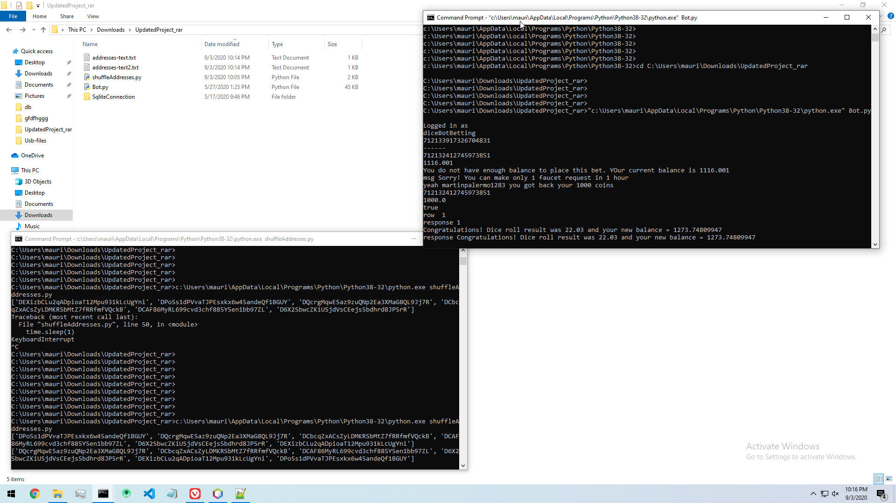
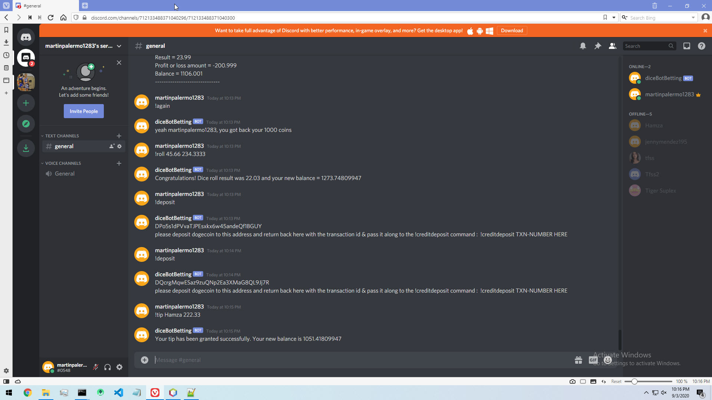

# DiceBettingCryptoDiscordBot


This is a discord bot for betting on dice rolls written in Python (front-end) and Java (back-end) with a SQLite database; it is for dealing with the crypto currency Dogecoin only (but you may modify it for using it with another crypto).

Start off first by downloading all the code here, and then proceed with unzipping the file "SqliteConnection.zip" ; you will need to have Python, Java, & Netbeans installed on the computer you plan on having this discord bot running on.

If you want to use it on your own discord server you will need to have a couple of items in order to config this to run on your discord; please refer to this (for getting setup first with your discord server, & in order to incorporate this bot into it.) . . . 

https://realpython.com/how-to-make-a-discord-bot-python/
OR
https://medium.com/@moomooptas/how-to-make-a-simple-discord-bot-in-python-40ed991468b4

. . . . 

Next, you will need to undertake these following steps:
```
Within the "Bot.py" file be sure to update accordingly the fields: fileLocation, TOKEN,
Within the "diceBot-Config.txt" file be sure to update accordingly the fields: database, house_edge, addFaucet,
Within the "DbHandler.java" file be sure to update accordingly the fields: DbLocation,
And within the "addresses-text2.txt" & "addresses-text.txt" file be sure to update accordingly with the crypto deposit addresses for your (wallet &) intended crypto coin to be used, if you plan to use another crypto coin besides Dogecoin then a number of things within all the code would have to be changed, namely the portions dealing with verifying deposits being made on the crypto blockchain; this code is hard-written for Dogecoin.
```
Now, to get this Discord Bot up and running, you will need to have two python command prompt windows running & have an Apache NetBeans (Java) window running the Java file "SqliteConnection.java" (in execution mode / running mode). Refer to the below screenshot for the How-To . . . 








-window.jpg)


. . . And yes this is intended for running on a Windows box, but you may run it on Mac or Linux or any other OS so long as you have Apache NetBeans installed..... I never got around to simply creating a Java executable that you could have running instead of being forced to have it running through Apache NetBeans; but this easy enough to be done by yourself (I'd recommend googling how to create Java executable).

The order in which you bring up these windows (Java running in Apache NetBeans, the python Bot.py running window, & the python shuffleAddresses.py running window) doesn't matter, but all 3 of them need to be running in order for this discord bot to run correctly.

Now for the fun part, get into your discord server where you have this bot running, and have a go with these commands:
```
!hello
!roll
!balance
!again
!deposit
!creditdeposit
!tip
!rain
!faucet
!history
!hellotest
!rolltest
!balancetest
!againtest
!deposittest
!creditdeposittest
!tiptest
!raintest
!faucettest
!historytest
```
So for example, if you want to roll the dice, execute the command like this: !roll 23.99 100.50
here you would be setting the win chance to 23.99% and you are betting 100.50 of your crypto coin on this dice roll

Now ..... "that's all folks"!
enjoy your new discord bot, modify it as you see fit, thanks for following along and using my bot.
